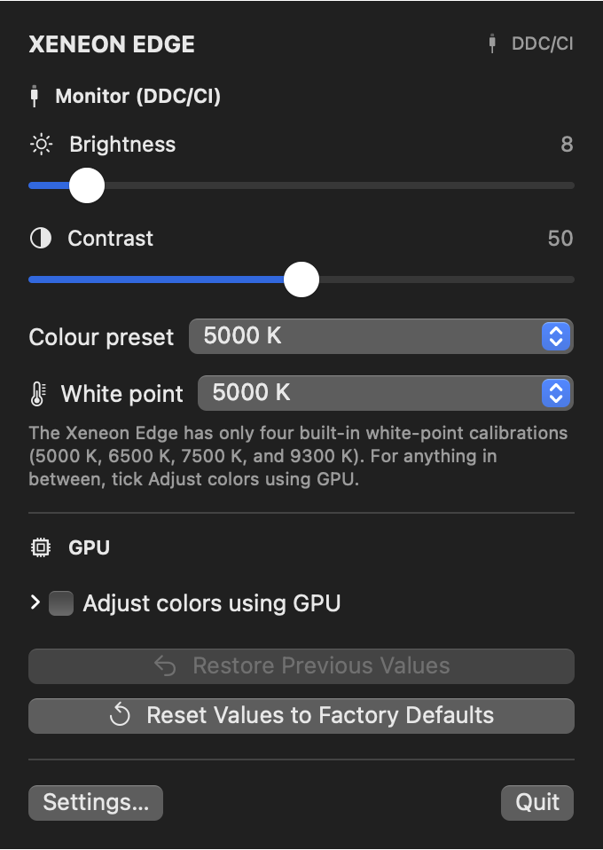
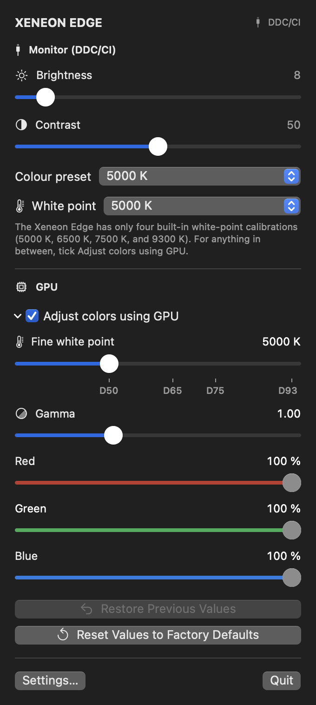
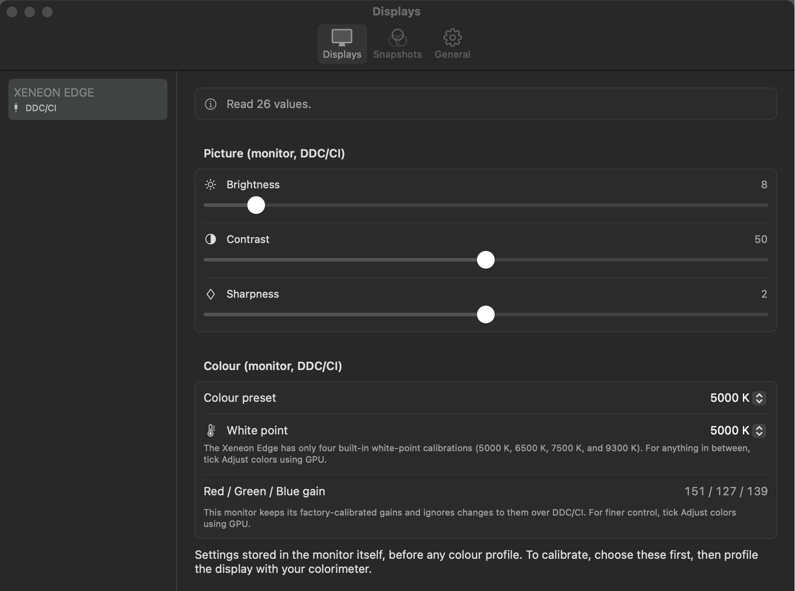
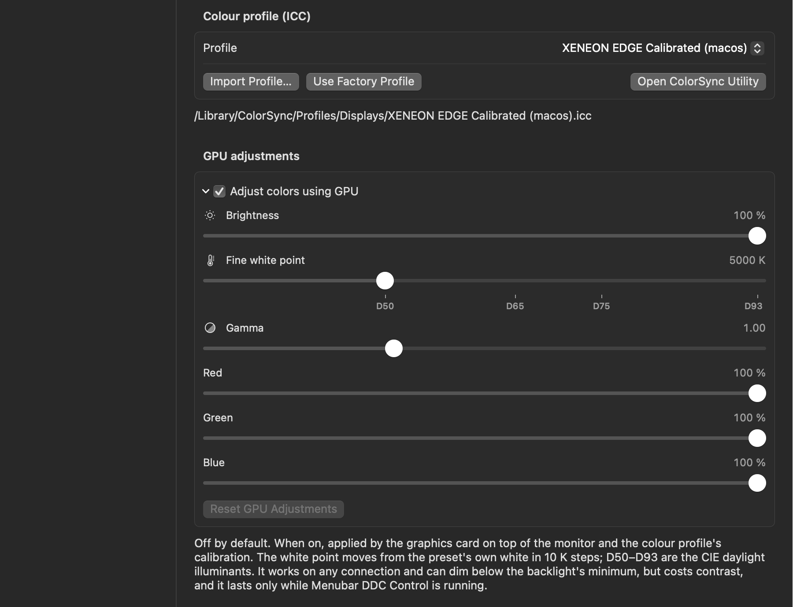
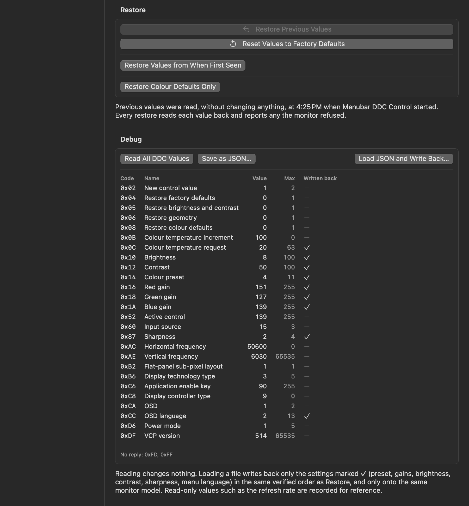
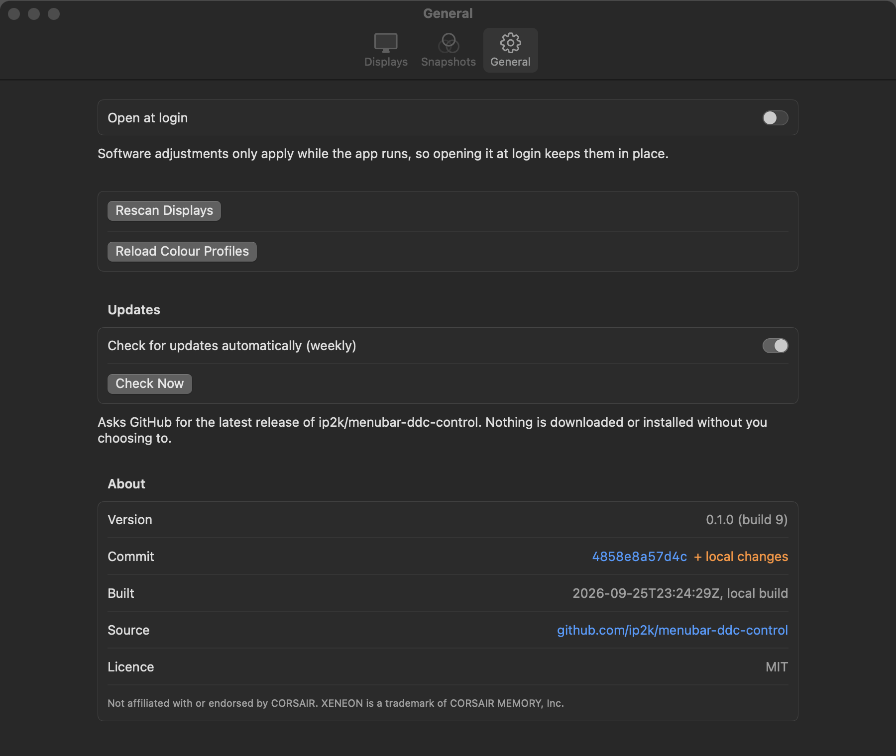

# Menubar DDC Control

Control your monitor's own settings from the macOS menu bar: brightness, contrast, sharpness,
colour presets, white point and more, sent to the monitor over DDC/CI. It works with most
DDC/CI monitors, and it was built for the **CORSAIR XENEON EDGE**. The Edge has no on-screen
menu, and its official app (iCUE) is Windows-only, so on a Mac this is the way to reach its settings.

<p align="center">
  
</p>

> Not affiliated with or endorsed by CORSAIR. XENEON is a trademark of CORSAIR MEMORY, Inc.

## Features

**Your monitor's real settings, first.** By default the app changes only the monitor's own
settings, over DDC/CI, exactly as its buttons or vendor software would.

- Brightness, contrast and sharpness, using the ranges the monitor reports.
- Colour presets, and a **White point** menu of the monitor's built-in white points. The
  Xeneon Edge has only four, at 5000, 6500, 7500 and 9300 K, and the app says so.
- Menu language, and the monitor's own restore commands.
- Controls are built from the monitor's capabilities string, so you only see what your monitor
  supports. A monitor that silently ignores a setting gets that control greyed out with an
  explanation, instead of a slider that does nothing.

**Optional GPU adjustments, off until you ask.** Tick **Adjust colors using GPU** for what the
hardware can't do: a fine white point from 3000 to 9300 K in 10 K steps with D50/D65/D75/D93
marks, gamma, red/green/blue balance, and dimming below the backlight's minimum. They're applied
on top of your colour profile's calibration, and unticking the box switches them off at once.

<p align="center">
  
</p>

**A way back, always.**
- When the app starts, it reads every monitor's settings, without changing anything, before it
  allows a single write.
- **Restore Previous Values** puts everything back as it was: monitor settings, colour profile
  and GPU adjustments. It then reads each value back and names any the monitor refused.
- **Reset Values to Factory Defaults** asks for a second click first.
- A copy of each monitor's settings from the first time the app saw it is kept too.
- On the Xeneon Edge, returning to the User 1 preset automatically restores its factory
  calibration if another preset wiped it.

**Colour profiles.** Assign any installed ICC profile per display, import `.icc`/`.icm` files
(such as ones made with a colorimeter), or revert to the factory profile. This is the same setting
as System Settings → Displays.

<p align="center">
  
</p>

<p align="center">
  
</p>

**Snapshots.** Save a display's whole setup under a name, such as "Evening" or "Photo editing",
and apply it from the menu bar.

**Debug tools** (in Settings):
- **Read All DDC Values** lists every code the monitor advertises, with its value and range.
- **Save as JSON** saves that list.
- **Load JSON and Write Back** puts the settings from a saved file back. It only accepts files
  from the same monitor model, and checks every value afterwards.

<p align="center">
  
</p>

**Updates.** A weekly check for new releases on GitHub, on by default, which you can switch off
in Settings. It tells you when there's a new version and never installs anything by itself.
**About** shows exactly which build you have: version, commit and build date.

<p align="center">
  
</p>

**`ddc-control` command-line tool**, bundled with the app:

```sh
ddc-control list                    # displays, and whether they answer DDC/CI
ddc-control get brightness
ddc-control set brightness 40
ddc-control caps                    # the monitor's capabilities string, parsed
ddc-control dump edge.json          # every value, as JSON (read-only)
ddc-control load edge.json          # write a saved file back, verified
ddc-control profile                 # the display's ICC profile
```

`--display <name>` picks a display; the default is the Xeneon Edge, else the first external one.

## Install

Apple Silicon, macOS 14 or later.

**Homebrew:**

```sh
brew tap ip2k/menubar-ddc-control https://github.com/ip2k/menubar-ddc-control
brew install --cask menubar-ddc-control
```

This also puts `ddc-control` on your `PATH`. Update with `brew upgrade --cask menubar-ddc-control`.

**Disk image:** download `Menubar-DDC-Control-<version>.dmg` from
[Releases](https://github.com/ip2k/menubar-ddc-control/releases), open it, and drag the app to Applications.

**Opening it the first time.** The app is ad-hoc signed, not notarized by Apple, so macOS blocks
it the first time. Either open it once, then go to **System Settings → Privacy & Security** and
click **Open Anyway**, or run:

```sh
xattr -dr com.apple.quarantine "/Applications/Menubar DDC Control.app"
```

## The connection matters

DDC/CI needs a link that carries it. **Connect the Xeneon Edge over USB-C (DisplayPort Alt Mode)**,
with a cable that carries video. The built-in HDMI port on M1-generation MacBook Pros blocks
DDC/CI, and some docks and adapters drop it too. On those links the app can only offer GPU
adjustments, and it tells you so.

## Xeneon Edge DDC/CI reference

[docs/xeneon-edge-ddc.md](docs/xeneon-edge-ddc.md) documents every VCP code the Edge advertises:
what each one controls, its range and factory value, and what happens when you write it. It also
covers the quirks (RGB gains are read-only; some presets wipe User 1's calibration) and how to
recover. It applies to any tool on any OS, not only this app.

## Privacy

The only network request the app makes is the update check, a weekly `GET` of this repository's
latest release from `api.github.com`, and you can switch it off. Everything else stays on your Mac.

## Build from source

Requires Xcode 16 or later.

```sh
swift test                            # unit tests (no monitor needed)
./scripts/build-app.sh --install      # builds "Menubar DDC Control.app" and copies it to ~/Applications
./scripts/make-dmg.sh                 # packages the built app as a disk image
```

The app is unsandboxed: it talks to the display over private `IOAVService` I2C functions (as
[m1ddc](https://github.com/waydabber/m1ddc) and MonitorControl do) and changes ColorSync profiles,
so it can't be distributed through the Mac App Store.

## Releasing

1. Move the `## [Unreleased]` entries in `CHANGELOG.md` under a new `## [x.y.z] - date` heading.
2. Merge that, then tag it: `git tag vx.y.z && git push origin vx.y.z`.

The **Release** workflow tests and builds the app with that version stamped in, packages the
disk image, and publishes a GitHub release. The release notes are that version's CHANGELOG
section plus the image's SHA-256. The workflow then updates the Homebrew cask on `main`.

## License

[MIT](LICENSE)
